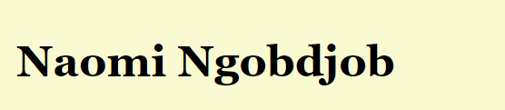
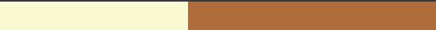
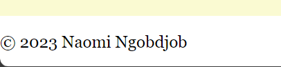

# Naomi Ngobdjob's Portfolio Design System Documentation
This documentation provides a clear and simplified overview of the design system used for the portfolio project. It includes colors, typography, components, and layouts, along with screenshots of mock-ups for clear communication of the design.

## 1. Color Palette
We use a simple and clear color palette throughout the design.

    Primary Color: #ffffff 
    Text Color: #000000
    ?Border Color: #ddd
    Background Color:#ad6c3a
    Secondary Background Color:#fafad2
    ?Accent Color: #444
    
## 2. Typography
    Body Text: Georgia,"Times New Roman", Times, serif,monospace
    Headers:Georgia,"Times New Roman", Times, serif,monospace

## 3. Components and Layout
    Header:
    Design: Left Centered text with a lightgoldenrodyellow background
    Mock-up Screenshot:
    
    
    Side bar:
    Design: Left Centered text with a lightgoldenrodyellow background
    Mock-up Screenshot:
    
    
    
    
## 4. Navigation
    Design:Divider with both lightyellow and lightbrown background.
    Mock-up Screenshot:
     
    
## 5.Content
    Design: Right centered section with a light brown background
    Mock-up Screenshot:
    
## 6.Footer
    Design: Left centered text with a white background.
    Mock-up Screenshot:
    
    
## Conclusion
This documentation serves as a concise reference guide for the design system used in the portfolio project, aiming to facilitate development and maintain consistency in design throughout the project.
